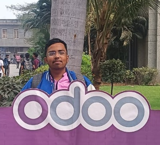
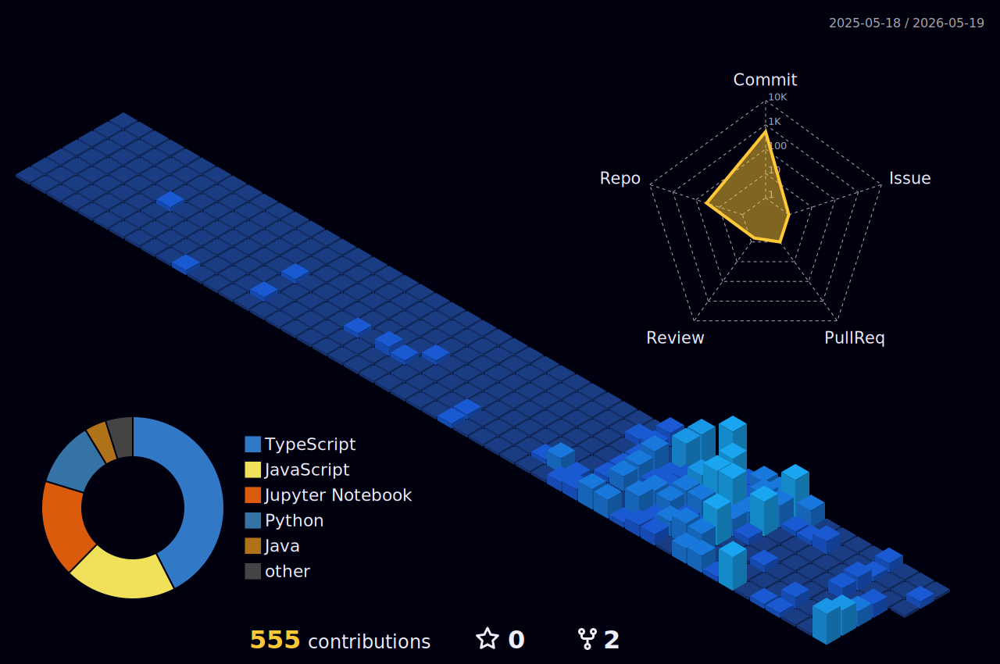

<!-- Profile README for AfzalSurti -->

<h1 align="center">
  
   
  Hi, I'm Afzal N. Surti 👋
</h1>

  Full-Stack Developer • AI/ML Builder • CS Undergrad (2023–2027)

  <a href="https://afzal-surti.vercel.app/">🌐 Portfolio</a> •
  <a href="https://www.linkedin.com/in/afzal-surti-9904b2287/">LinkedIn</a> •
  <a href="https://github.com/AfzalSurti">GitHub</a> •
  <a href="https://pdflink.to/eefffc11/">Resume (PDF)</a>

---

## 🚀 About Me
- 🎓 BE in Computer Science @ The Maharaja Sayajirao University, Vadodara (CGPA: 8.69)
- 💼 Full Stack Web Developer Intern @ Enlighten Infosystem (May 2025 – July 2025)
- 🧠 I love building **production-ready web apps** and **AI-powered systems**

---

## 🏆 Achievements

<table>
<tr>
<td width="50%">

### 🚀 Hackathons
- 🥇 **Top 79 / 750+ teams** — Odoo Hackathon (Selected for offline round)
- 🏅 **On-site Qualifier** — MumbaiHacks Hackathon
- 🥈 **Top 10 / 85+ teams** — University Hackathon

</td>
<td width="50%">

### 🎓 Academic Excellence
- 📊 **CGPA: 8.69** — BE Computer Science
- 🏆 **GUJCET Rank 605** — State-level Engineering Entrance Exam
- 💡 Focus on AI/ML & Full-Stack Development

</td>
</tr>
</table>

---

## 🧰 Tech Stack

### Languages

  
  
  
  
  

### Frontend

  
  
  
  
  
  

### Backend

  
  
  
  

### Databases & DevOps

  
  
  
  
  

### AI/ML

  
  
  
  

---

## 🔥 Featured Projects
### [🏗️ Sankalp — Civil Engineering Operations Platform](https://github.com/AfzalSurti/roadway-ops-hub)
- Centralized web platform replacing disconnected Excel workflows for civil project operations.
- Covers task/project lifecycle, planning timelines, financial workflows (RA bills, excess/carry-forward), notifications, and reporting.
- Built with React + TypeScript + Vite + Tailwind, Node.js + Express + TypeScript, Prisma (SQLite/PostgreSQL), JWT auth, and RBAC.

### [🛒 Surti Farsaan — E-Commerce Platform (PHP + MySQL)](https://github.com/AfzalSurti/surti-farsaan)
- Full-stack e-commerce app with separate **Admin** + **Customer** panels
- Product catalog, cart, checkout, order management + admin dashboard
- Security best practices: sessions, validation, SQL-injection prevention

### [🤖 Amazon Recommender — AI Product Recommendation System](https://github.com/AfzalSurti/AmazonRecommender)
- Scraped category-wise product data using Selenium + BeautifulSoup
- Semantic search with Sentence Transformers (`all-MiniLM-L6-v2`)
- Flask app for inference + clean UI, deployed with live product details

### [📊 Log-Monitor Dashboard — Real-Time Server Monitoring](https://github.com/AfzalSurti/SystemProgramming)
- C log parser → structured JSON incidents/metrics/alerts pipeline
- Express API + live dashboard to visualize error trends & latency spikes
- AI-generated alert summaries (Gemini API) + incident search/grouping

---

## 🧠 LeetCode Stats

  

---

## 📊 GitHub Analytics Dashboard

  
  

  

  

  

  
  

  
  

### 🧊 3D Contribution Graph

  

---

## 🤝 Let’s Connect
- 📧 Email: surtiafzal915@gmail.com
- 💼 LinkedIn: https://www.linkedin.com/in/afzal-surti-9904b2287/

---

### ✅ What I’m focusing on right now
- Building full-stack products with **Next.js + Node.js**
- Creating practical **AI systems** (recommendations, search, automation, monitoring)
- Writing clean, maintainable, production-level code

⭐ If you like my work, consider following — it helps a lot!
---

## 💼 Open for Freelance Work & Internships

  
  

I bring ideas to life with code. Whether you need a **production-ready web application**, **intelligent AI solutions**, or **scalable cloud infrastructure**, I've got you covered.

### 🚀 What I Deliver:

<table>
<tr>
<td width="25%" align="center">

  
<b>Full-Stack Websites</b>
 
Modern, responsive web apps with React, Next.js, Node.js, and databases
</td>
<td width="25%" align="center">

  
<b>AI Agents</b>
 
Intelligent automation systems, chatbots, and task-specific AI assistants
</td>
<td width="25%" align="center">

  
<b>Custom AI Models</b>
 
ML models for recommendations, NLP, computer vision, and predictive analytics
</td>
<td width="25%" align="center">

  
<b>Cloud Solutions</b>
 
Dockerized deployments, CI/CD pipelines, and scalable cloud architecture
</td>
</tr>
</table>

### ✨ Why Work With Me?
- ⚡ **Fast turnaround** with quality code
- 🎯 **Production-ready** solutions, not prototypes
- 🔒 **Secure & scalable** architecture from day one
- 💬 **Clear communication** throughout the project

📩 **Let's build something amazing together!** Reach out at **surtiafzal915@gmail.com**

---
