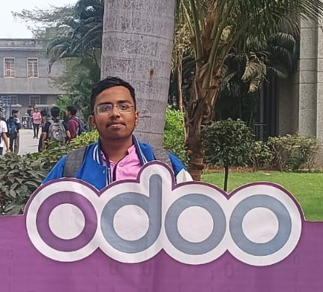
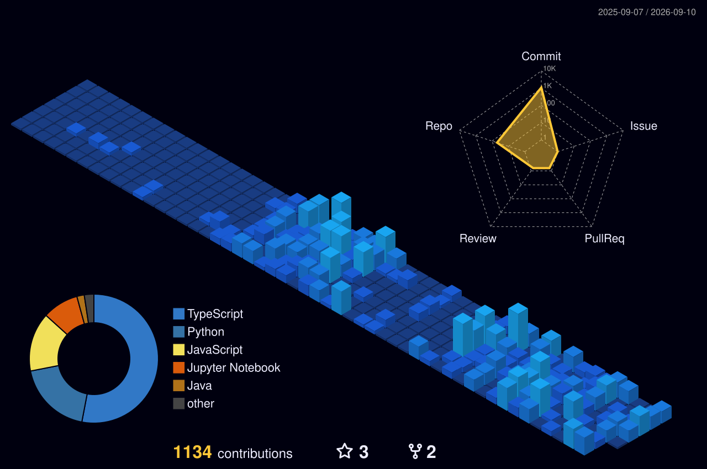

<!-- Profile README for AfzalSurti -->

# Afzal N. Surti

**Full-Stack Developer · AI/ML Engineer · B.E. Computer Science (2023–2027)**

I build production web platforms and applied AI systems — from highway-operations software used by field teams to LLM agents, RAG pipelines and computer-vision models.

---

## About Me

- 💼 **Software Developer** at **Geo Designs & Research Pvt. Ltd.**, Vadodara (Mar 2026 – present) — building HighwayOps Hub, the GDRPL Survey system, an attendance platform and MailDesk
- 💼 **Full-Stack Web Developer Intern** at **Enlighten Infosystem** (May 2025 – Jul 2025)
- 🎓 **B.E. Computer Science**, The Maharaja Sayajirao University of Baroda — CGPA **8.69**
- 🎯 **Open to** full-time Software Developer / AI-ML roles and internships

## Achievements

| Hackathons | Academics |
|---|---|
| 🥇 **Top 79 / 750+ teams** — Odoo Hackathon (selected for offline round) | 📊 **CGPA 8.69** — B.E. Computer Science |
| 🏅 **On-site qualifier** — MumbaiHacks | 🏆 **GUJCET Rank 605** — state engineering entrance |
| 🥈 **Top 10 / 85+ teams** — University Hackathon | 🧪 Amazon ML Challenge 2025 · Smart India Hackathon participant |

---

## Tech Stack

**Languages**
 

**Frontend & Mobile**
 

**Backend**
 

**Data, AI & ML**
 

**Databases & DevOps**
 

---

## Featured Projects

<table>
<tr>
<td width="50%" valign="top">

### 🏗️ [HighwayOps Hub](https://github.com/AfzalSurti/roadway-ops-hub)
Task, report and finance management platform for highway/construction teams — task lifecycle, daily field reports, planning timelines, RA bills, notifications and RBAC. Replaces scattered Excel workflows.
 `React` `TypeScript` `Node.js` `Prisma` `PostgreSQL`

</td>
<td width="50%" valign="top">

### 🏢 [SpringERP](https://github.com/AfzalSurti/SpringERP)
Full-stack ERP monorepo with JWT authentication, Caffeine caching and rate limiting.
 `Spring Boot` `Java` `React` `TypeScript`

</td>
</tr>
<tr>
<td width="50%" valign="top">

### 🚦 [ATCC — Traffic Counter & Classifier](https://github.com/AfzalSurti/ATCC)
Video-based vehicle detection, classification, tracking and per-lane counting with Excel export, live RTSP, a React upload dashboard and ONNX/TensorRT export.
 `Python` `Computer Vision` `React`

</td>
<td width="50%" valign="top">

### 🤖 [Hiver — AI Customer Support Agent](https://github.com/AfzalSurti/Hiver)
AI support agent for a single brand (SpotifyCares) built on the Kaggle Customer Support on Twitter dataset.
 `Python` `LLMs` `NLP`

</td>
</tr>
<tr>
<td width="50%" valign="top">

### 📧 [MailDesk](https://github.com/AfzalSurti/MailDesk)
Company email management — Gmail sync, AI categorisation and a team dashboard.
 `React` `Vite` `Zustand` `Python` `SQL`

</td>
<td width="50%" valign="top">

### ⚙️ [Mini C Compiler](https://github.com/AfzalSurti/Mini_C_Compiler)
Full compilation pipeline — lexer, parser, semantic analysis, IR generation, optimisation and LLVM code generation down to native execution.
 `Python` `LLVM` `Compilers`

</td>
</tr>
</table>

---

## Project Index

<b>🏗️ Infrastructure & Highway Tech</b>

 

| Project | Description | Stack |
|---|---|---|
| [roadway-ops-hub](https://github.com/AfzalSurti/roadway-ops-hub) | HighwayOps Hub — task & report management for highway operations | React, TS, Node, Prisma |
| [Survey_Application](https://github.com/AfzalSurti/Survey_Application) | GDRPL Survey — highway structure & utility inventory survey system | Python, React, TS |
| [RoadService](https://github.com/AfzalSurti/RoadService) | Road issue management across Government, Admin, Contractor & Surveyor roles | Python, React, TS |
| [ATCC](https://github.com/AfzalSurti/ATCC) | Automatic traffic counter & vehicle classifier from video | Python, CV, React |
| [Estimation_Generation](https://github.com/AfzalSurti/Estimation_Generation) | Estimate generation tooling | Python |

<b>🤖 AI Agents, LLMs & RAG</b>

 

| Project | Description | Stack |
|---|---|---|
| [Hiver](https://github.com/AfzalSurti/Hiver) | AI customer-support agent for SpotifyCares | Python, LLMs |
| [railway](https://github.com/AfzalSurti/railway) | AI travel-booking agent — provider abstraction, Playwright browser layer, human-in-the-loop, observability | TypeScript, Playwright |
| [airesume](https://github.com/AfzalSurti/airesume) | AI recruitment & resume-screening platform | JavaScript, Python, SQL |
| [CSV-IMPORTER](https://github.com/AfzalSurti/CSV-IMPORTER) | LLM-powered CSV importer that maps any layout into a CRM schema, with live SSE progress | Next.js, TS |
| [RAG_pipeline](https://github.com/AfzalSurti/RAG_pipeline) | Retrieval-Augmented Generation over multi-format document collections | Python |
| [Model](https://github.com/AfzalSurti/Model) | RAG assistant over an educational dataset using OpenAI | Python, OpenAI |
| [MCP](https://github.com/AfzalSurti/MCP) | Model Context Protocol client, host & server experiments | Python |
| [LLM-From-Scratch](https://github.com/AfzalSurti/LLM-From-Scratch) | Building LLMs from scratch — neural nets, attention, transformers | Python, Jupyter |

<b>🧠 Machine Learning & Computer Vision</b>

 

| Project | Description | Stack |
|---|---|---|
| [AmazonRecommender](https://github.com/AfzalSurti/AmazonRecommender) | Semantic product search & recommendation with Sentence Transformers + scraped data | Python, Flask, Selenium |
| [VisionTransformer](https://github.com/AfzalSurti/VisionTransformer) | Vision Transformer (ViT) implementation | Python, PyTorch |
| [Image_Retrival](https://github.com/AfzalSurti/Image_Retrival) | Text-to-image retrieval with CLIP + FAISS | Python, CLIP, FAISS |
| [ComputerVision](https://github.com/AfzalSurti/ComputerVision) | Computer-vision experiments | Python, OpenCV |
| [clara](https://github.com/AfzalSurti/clara) | CLARA & PAM (k-medoids) clustering from scratch in pure Python | Python |
| [Amazon-ML-Challenge-2025](https://github.com/AfzalSurti/Amazon-ML-Challenge-2025) | Smart product pricing — Team CodeConquer | Python, ML |

<b>📈 Quantitative Finance</b>

 

| Project | Description | Stack |
|---|---|---|
| [QuantProjects](https://github.com/AfzalSurti/QuantProjects) | End-to-end quant workflow — market data, signal research, backtesting & risk analysis (AAPL) | Python, Pandas |

<b>🏢 Business Platforms, ERP & SaaS</b>

 

| Project | Description | Stack |
|---|---|---|
| [SpringERP](https://github.com/AfzalSurti/SpringERP) | ERP system with JWT auth, caching & rate limiting | Spring Boot, React |
| [MailDesk](https://github.com/AfzalSurti/MailDesk) | Gmail sync, AI categorisation & team dashboard | React, Python |
| [Attendence_Management_System](https://github.com/AfzalSurti/Attendence_Management_System) | Selfie + GPS attendance with admin reports | FastAPI, React Native (Expo) |
| [Budget-Accounting-System---Shiv-Furniture](https://github.com/AfzalSurti/Budget-Accounting-System---Shiv-Furniture) | Furniture ERP — budgets, accounting, orders & customer portal | Next.js, TS |
| [OdooXGCET](https://github.com/AfzalSurti/OdooXGCET) | Zarvo HRMS — employees, attendance, leave & payroll | React, TS, SQL |
| [FebricLens](https://github.com/AfzalSurti/FebricLens) | Fabric QC data portal with dynamic-schema CSV import | React, Node, SQL |
| [Backend_Assignment](https://github.com/AfzalSurti/Backend_Assignment) | Finance data backend with RBAC & dashboard analytics | Node.js, PostgreSQL |

<b>⚡ Automation & Messaging</b>

 

| Project | Description | Stack |
|---|---|---|
| [NookalIntegration](https://github.com/AfzalSurti/NookalIntegration) | Clinic automation stack integrated with Nookal | Python |
| [wa_auto_reply](https://github.com/AfzalSurti/wa_auto_reply) | WhatsApp auto-reply with AI templates | Node.js, React |
| [Festival_Greeting](https://github.com/AfzalSurti/Festival_Greeting) | FestiveSend — AI-generated WhatsApp festival greetings for business customers | Node.js, React |
| [Festival_Greeting_Message](https://github.com/AfzalSurti/Festival_Greeting_Message) | Festival greeting message service | Node.js |
| [Instagram](https://github.com/AfzalSurti/Instagram) | PostFlow — multi-user Instagram photo & reel auto-poster with Excel bulk import | Python, React |

<b>🌐 Web & E-Commerce</b>

 

| Project | Description | Stack |
|---|---|---|
| [surti-farsaan](https://github.com/AfzalSurti/surti-farsaan) | Grocery e-commerce with Admin & Customer panels | PHP, MySQL |
| [nordic-table-design](https://github.com/AfzalSurti/nordic-table-design) | Saffran — restaurant website with online booking | React, TS |
| [EvolutionGraphics](https://github.com/AfzalSurti/EvolutionGraphics) | Luzel Tea — premium D2C chai brand website | React |
| [Enlighten](https://github.com/AfzalSurti/Enlighten) | Web app from the Enlighten Infosystem internship | React, TS, Vite |
| [PC-Builder](https://github.com/AfzalSurti/PC-Builder) · [pc-builder-frontend](https://github.com/AfzalSurti/pc-builder-frontend) | Custom PC configurator | JavaScript, SQLite |

<b>🖥️ Systems & Compilers</b>

 

| Project | Description | Stack |
|---|---|---|
| [Mini_C_Compiler](https://github.com/AfzalSurti/Mini_C_Compiler) | C-like language → LLVM IR → native code | Python, LLVM |
| [SystemProgramming](https://github.com/AfzalSurti/SystemProgramming) | C log monitor + Express dashboard with AI alert summaries | C, Node.js |

<b>🏆 Hackathons</b>

 

| Project | Event |
|---|---|
| [SIH](https://github.com/AfzalSurti/SIH) | Smart India Hackathon — CycloneAI: tropical cyclone detection & prediction (Team TechNova) |
| [OdooXGCET](https://github.com/AfzalSurti/OdooXGCET) | Odoo × GCET Hackathon — Zarvo HRMS |
| [Amazon-ML-Challenge-2025](https://github.com/AfzalSurti/Amazon-ML-Challenge-2025) | Amazon ML Challenge 2025 — Team CodeConquer |

<b>📚 Learning & Coursework</b>

 

[AdvancedJavaTechnology](https://github.com/AfzalSurti/AdvancedJavaTechnology) ·
[JavaPractical](https://github.com/AfzalSurti/JavaPractical) ·
[Basics-Of-Web-Programming](https://github.com/AfzalSurti/Basics-Of-Web-Programming) ·
[Learning_Javascript](https://github.com/AfzalSurti/Learning_Javascript) ·
[ML](https://github.com/AfzalSurti/ML) ·
[DataSceince](https://github.com/AfzalSurti/DataSceince) ·
[AI](https://github.com/AfzalSurti/AI) ·
[Daily_Learning](https://github.com/AfzalSurti/Daily_Learning) ·
[Important_Links](https://github.com/AfzalSurti/Important_Links)

---

## GitHub Activity

<picture>
  <source media="(prefers-color-scheme: light)" srcset="./profile-daily/daily-commits-light.svg">
  
</picture>

---

**Let's connect** — open to full-time roles, internships and freelance projects.
 
📧 [surtiafzal915@gmail.com](mailto:surtiafzal915@gmail.com) · 💼 [LinkedIn](https://www.linkedin.com/in/afzal-surti-9904b2287/) · 🌐 [Portfolio](https://afzal-surti.vercel.app/)

